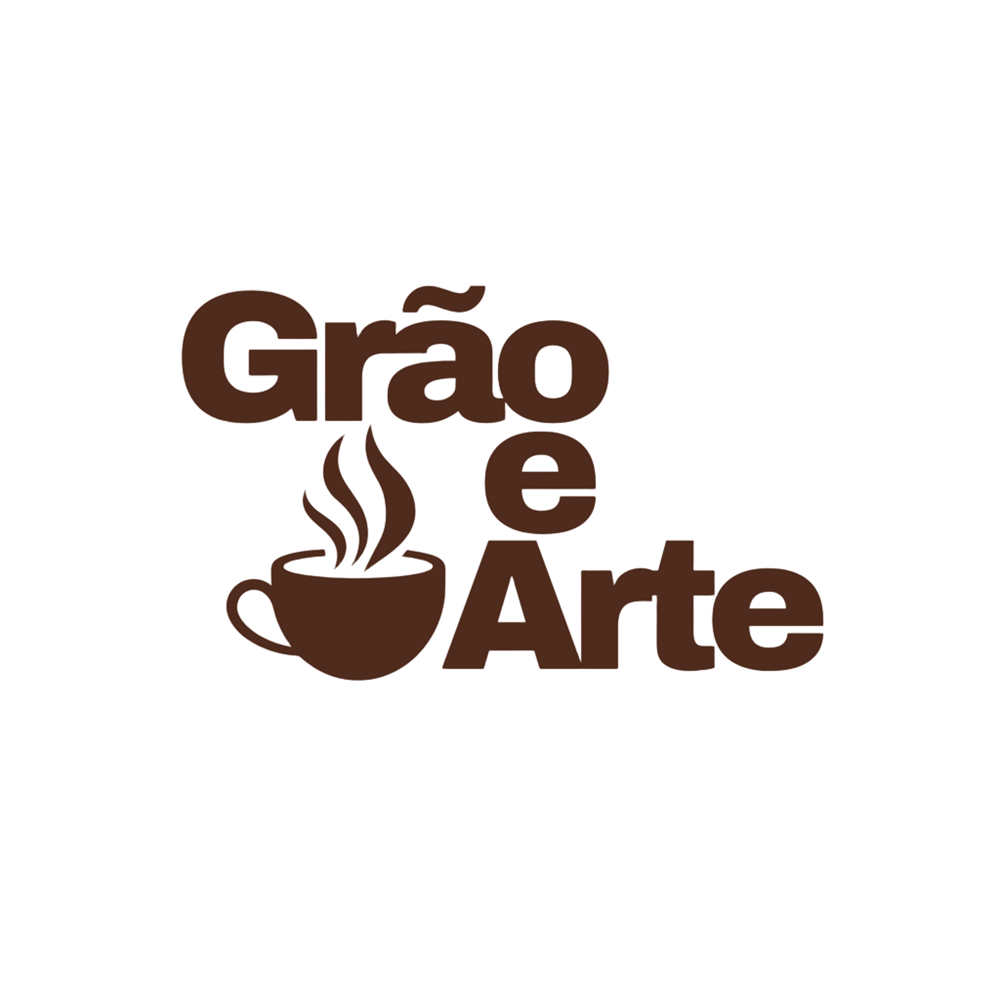

<div align="center"> 


# Grão & Arte | Coffee Experience

Landing page de alta fidelidade desenvolvida para uma cafeteria, focada em experiência sensorial do usuário, apresentação de cardápio e conversão direta via WhatsApp.

## 🖥️ Preview

| Desktop |
|--------|

<div align="center"> 

<div align="center"> 

<div align="center"> 
|--------|
| Mobile |
|--------|

<div align="center"> 

<div align="center"> 

<div align="center"> 

**[🌐 Ver site ao vivo](https://graoearte.netlify.app)** · **[Me contratar](https://wa.me/5527988796796?text=Olá%20Fernanda!%20Vim%20pelo%20seu%20portfólio%20e%20tenho%20interesse%20nos%20seus%20serviços.)**


## 🛠️ Quick Stack

| Categoria | Tecnologias |
| :--- | :--- |
| **Frontend** | HTML5 Semântico, CSS3 (Flexbox, Animations, Responsive Design) |
| **Interatividade** | JavaScript (Controle de mídia e navegação) |
| **Deploy/CI-CD** | GitHub & Netlify (CI/CD via branch `main`) |

---


## Engenharia de Interface
 
### 🎬 Hero Section em Vídeo Loop
A primeira seção do site é composta por um vídeo em loop infinito (`autoplay`, `loop`, `muted`, `playsinline`) que imersiona o usuário na atmosfera da marca desde o primeiro acesso. A escolha pelo vídeo como elemento hero substitui o padrão de imagem estática, criando impacto imediato e aumentando o tempo de retenção na página.
 
### 🎥 Vídeo de Produto — Personalização
Um segundo vídeo foi implementado na seção de produto, demonstrando o processo de personalização dos copos. Esta técnica reduz a fricção na percepção de valor do item e comunica o diferencial da marca de forma visual e direta.
 
### 🗺️ Arquitetura de Navegação Smooth-Scroll
Utilização de IDs de âncora (`#inicio`, `#sobre`, `#cardapio`, `#contato`) combinados com a propriedade `scroll-behavior: smooth`. Esta abordagem elimina saltos abruptos de tela, proporcionando uma transição elegante entre a narrativa da marca e o cardápio operacional.
 
### 🍽️ Cardápio Estruturado em Seções
Organização do cardápio em três categorias distintas — Cafés & Bebidas, Aperitivos & Salgados e Sobremesas — com destaque visual para os itens mais pedidos através de cards com imagem. A hierarquia de conteúdo foi pensada para guiar o olhar do usuário do produto âncora até os itens complementares.
 
### 📲 Otimização de Conversão (Lead Gen)
Integração direta com a API do WhatsApp através de links parametrizados (`wa.me`). O botão de ação principal (CTA) foi projetado para abrir em nova aba (`target="_blank"`), garantindo que o usuário não perca o contexto de navegação no site.
 
### 📱 Mobile First & Responsividade
Layout 100% responsivo, testado e funcional em dispositivos móveis. Todos os elementos — cardápio, vídeos, navegação e CTAs — foram adaptados para garantir a mesma experiência de qualidade em qualquer tamanho de tela, do celular ao desktop.


**Identidade Visual:**
Logo criada do zero — incluindo composição tipográfica, símbolo e paleta —
transmitindo a essência artesanal e sofisticada da marca.


**Tipografia:**
- Fonte display serifada para títulos — transmite sofisticação e identidade artesanal
- Fonte sans-serif para corpo e cardápio — garante legibilidade em todos os dispositivos
 
**Paleta de Cores:**
- Fundo principal: `#F3F0EB` — bege orgânico que evoca a estética do café artesanal
- Texto e elementos: `#4B2C20` — marrom terroso, referência direta ao grão de café
- Contrastes e destaques: tons quentes que reforçam o posicionamento premium da marca
 
**Favicon Customizado:**
Implementação de favicon com a identidade da marca para garantir reconhecimento em múltiplas abas do navegador.
 
---


## 📂 Estrutura do Projeto
 
```
grao-e-arte/
├── index.html
├── style.css
├── script.js
├── imagens/
│   ├── grao-e-arte.png.png
│   ├── cafe-xicara.jfif
│   ├── imagem-expresso.png
│   ├── expresso-chocolate.png
│   ├── cha-gelado.png
│   └── croa.png
└── videos/
    ├── video-hero.mp4
    └── video-produto.mp4
```
 
---


## 🚀 Como Executar o Projeto
 
```bash
# Clone o repositório
git clone https://github.com/fernandavaleriano/graoearte.git
 
# Acesse a pasta
cd graoearte
```

Abra o arquivo `index.html` em qualquer navegador moderno.
Para produção, o projeto está configurado para deploy automático via branch `main`.
 
> Nenhuma dependência ou instalação necessária. Projeto 100% em HTML, CSS e JS puro.
 
---


## 💼 Serviços que Ofereço
 
Este projeto é uma amostra do que posso criar para o seu negócio:
 
- ☕ **Landing pages** para cafeterias, restaurantes e negócios gastronômicos
- 🎨 **Sites institucionais** para clínicas, salões, estúdios e negócios locais
- 🖌️ **Identidade visual** — criação de logo, marca, paleta e tipografia do zero
- 📱 **Design responsivo** — experiência perfeita em celular e desktop
- 🚀 **Deploy e hospedagem** rápida via Netlify com CI/CD automático
- 🔗 **Integração com WhatsApp** para conversão direta de clientes
 
---

## 📩 Contato

<a href="https://github.com/fernandavaleriano" target="_blank" rel="noopener noreferrer">
  
</a>

<a href="https://wa.me/5527988796796?text=Olá%20Fernanda!%20Vim%20pelo%20seu%20portfólio%20e%20tenho%20interesse%20nos%20seus%20serviços." target="_blank" rel="noopener noreferrer">
  
</a>

<a href="mailto:fernandaramosvaleriano@gmail.com" target="_blank" rel="noopener noreferrer">
  
</a>

## Project Disclosure
 
Este é um projeto fictício de portfólio. A marca **Grão & Arte** e seus ativos visuais foram criados exclusivamente para demonstração de competências técnicas em desenvolvimento web e design de interface.


*As imagens utilizadas neste projeto foram geradas com Inteligência Artificial
para fins de demonstração visual. Projeto sem fins comerciais.*


<div align="center">
Feito por Fernanda Valeriano

</div>